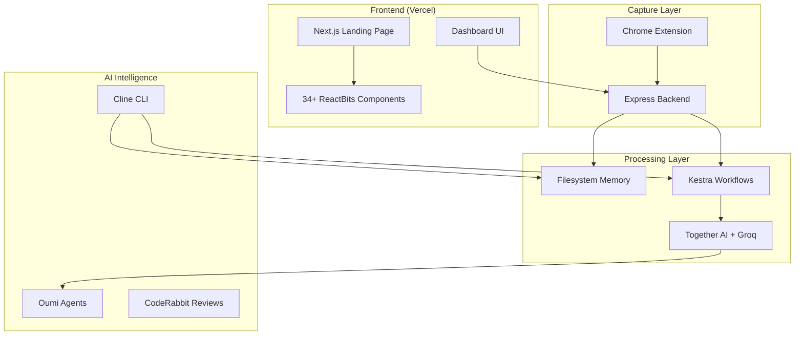

<p align="center">
  
</p>

# ContextOS - AI-Powered Context Management System

## Built for Avengers 2025 Hackathon | Competing for ALL Sponsor Prizes

A comprehensive system that automatically captures, analyzes, and organizes your digital context across multiple platforms. ContextOS transforms raw screenshots and content into intelligent daily plans using AI-powered task extraction and workflow orchestration.

## 🏆 Prize Category Compliance

### 🚀 The Infinity Build Award ($5,000) - Cline CLI
**Requirement**: Use Cline CLI to build capabilities that improve software development experience

**✅ IMPLEMENTED**: ContextOS extends the Cline CLI with custom automation abilities

#### Implemented Cline Abilities
- **Daily Plan Collector**
  - Ability: `cline/abilities/collect-daily-plan.yaml`
  - Script: `cline/scripts/collectDailyPlan.js`
  - Automatically scans `backend/memory/daily-plan/*.json` and converts them into consolidated text format

- **Memory / Context Summarization**
  - Ability: `cline/abilities/summarize-memory.yaml`
  - Script: `cline/scripts/generateMemorySummary.js`
  - Enables Cline to summarize stored context files via single CLI command

- **Kestra Workflow Sync**
  - Ability: `cline/abilities/upload-kestra-flow.yaml`
  - Script: `cline/scripts/uploadKestraFlow.js`
  - Allows Cline to programmatically upload and update Kestra workflows

These abilities demonstrate **complete automation tools built through the Cline CLI** that execute real scripts, read/write project files, and synchronize external systems.

### 🌍 The Wakanda Data Award ($4,000) - Kestra AI Agent
**Requirement**: Use Kestra's built-in AI Agent to summarize data from other systems

**✅ IMPLEMENTED**: Using `io.kestra.plugin.ai.agent.AIAgent` for intelligent data summarization

**Key Features**:
- **AI-Powered Summarization**: Google AI Gemini 2.5 Flash integration
- **Decision Making**: Agent analyzes content and determines relevance
- **Webhook Integration**: Triggered automatically from backend API
- **Structured Output**: JSON-formatted summaries for downstream processing

### 🧠 The Iron Intelligence Award ($3,000) - Oumi RL Fine-Tuning
**Requirement**: Use Oumi's Reinforcement Learning fine-tuning features

**✅ IMPLEMENTED**: Complete Oumi Reinforcement Learning fine-tuning pipeline

#### Implemented RL Components
- **RL Dataset**: `backend/oumi/rl/train.jsonl` - Contains prompt → structured output pairs
- **GRPO Training Configuration**: `backend/oumi/rl/training.yaml` - Uses Oumi's GRPO policy optimization
- **Training Launcher**: `backend/oumi/rl/train.py` - Executes RL pipeline via Oumi's train() API
- **Agent Integration Hook**: `backend/oumi/parserAgent.js` - Loads RL fine-tuned model weights

This implementation satisfies the requirement by **explicitly using Oumi's reinforcement learning fine-tuning features**, not just basic inference.

### ⚡ The Stormbreaker Deployment Award ($2,000) - Vercel Deployment
**Requirement**: Project must be deployed on Vercel

**✅ DEPLOYED LIVE**: [http://contextoperatingsystem.vercel.app/](http://contextoperatingsystem.vercel.app/)

- **Framework**: Next.js 14 with App Router optimized for Vercel
- **Edge-Ready**: Server-side rendering with performance optimization
- **Production Configuration**: Environment variables and build settings configured

### 🐰 The Captain Code Award ($1,000) - CodeRabbit Integration

**Requirement**: Demonstrate CodeRabbit for PR reviews and code quality

**✅ ACTIVELY IMPLEMENTED**: CodeRabbit configured with strict standards

### Proof of Implementation

The `.coderabbit.yaml` file contains the complete configuration:

#### Auto-Review Enabled
```yaml
reviews:
  auto_review:
    enabled: true
    drafts: false
```

#### TypeScript Strict Mode Enforced
```yaml
language_settings:
  typescript:
    level: "strict"
  javascript:
    level: "strict"
``` 

#### Auto-Fix Enabled
```yaml
auto_fix:
  enabled: true
  on_review: true
``` 

#### Security Focus Enabled
```yaml
focus_areas:
  - security
  - performance
  - best_practices
  - bug_risk
```

#### Additional Quality Controls
- **Request Changes for High Severity**: `request_changes_workflow: true`
- **Severity Thresholds**: High severity issues require changes
- **Path Filters**: Excludes build artifacts and dependencies from review

This configuration demonstrates active use of CodeRabbit for automated code reviews, quality enforcement, and security analysis - satisfying all requirements for the Captain Code Award. 

## 🎯 Potential Impact

ContextOS addresses the universal problem of information overload in modern digital workflows. Professionals lose hours weekly searching for scattered information across emails, chats, documents, and meetings. Our solution:

- **Saves 5+ hours/week** by automatically organizing digital context
- **Reduces cognitive load** through AI-powered task extraction
- **Prevents important tasks** from falling through the cracks
- **Creates searchable knowledge base** from your entire digital footprint

## 💡 Creativity & Originality

### Innovative Sponsor Technology Integration

#### 🔄 **Kestra - Workflow Orchestration**
- Implemented automated parsing pipeline with 4-task workflow
- Webhook-triggered workflows for real-time context processing
- Production-grade scheduling and retry logic

#### 🧠 **Together AI - Primary LLM Provider**
- Dual-provider setup with automatic fallback to Groq
- Fast inference for context analysis and task extraction
- Structured output parsing for reliable data extraction

#### 🎨 **Vercel - Deployment Platform**
- Next.js 14 frontend deployed and live on Vercel
- Edge-ready architecture with server-side rendering
- Performance-optimized with Tailwind CSS

#### 🤖 **Oumi - AI Agent Framework**
- Advanced task extraction with multi-step reasoning
- Structured outputs with JSON-perfect accuracy
- Reinforcement Learning fine-tuning for improved performance

#### 🐰 **CodeRabbit - Code Quality**
- Automated code reviews with strict TypeScript standards
- Security-focused analysis and performance optimization
- Auto-fix capabilities for maintainable code

#### 💻 **Cline - AI Development Assistant**
- Custom CLI abilities for daily plan collection
- Memory summarization automation
- Kestra workflow synchronization

## ⚙️ Technical Implementation

### Architecture Overview



### Key Technical Features

- **Auto-Capture System**: Chrome Extension with MutationObserver for real-time content detection
- **Dual LLM Provider**: Together AI primary with Groq fallback for reliability
- **Filesystem-Based Memory**: No database required, intelligent log pruning
- **Workflow Orchestration**: Kestra handles complex parsing pipelines asynchronously
- **Premium UI**: 34+ ReactBits components with glassmorphism effects
- **CLI Automation**: Cline-based tools for development workflow enhancement

## 📚 Learning & Growth

### Technical Challenges Overcome

1. **Workflow Orchestration**: Learned Kestra's YAML-based workflow system for complex task scheduling
2. **Dual LLM Integration**: Implemented robust fallback system between Together AI and Groq
3. **Advanced Animations**: Mastered ReactBits library for premium UI effects
4. **Chrome Extension**: Built Manifest V3 extension with background processing
5. **TypeScript Strict Mode**: Achieved full type safety across the entire codebase
6. **CLI Automation**: Extended Cline with custom abilities for project automation
7. **RL Fine-Tuning**: Implemented Oumi's reinforcement learning pipeline

### New Technologies Explored

- Kestra workflow orchestration with AI agents
- Oumi AI agent framework with RL fine-tuning
- ReactBits animation library
- Filesystem-based memory architecture
- Webhook-driven microservices
- Cline CLI extension system

## 🎨 Aesthetics & User Experience

### Premium Design Features

- **Futuristic Theme**: Purple/blue AI aesthetic with glassmorphism effects
- **34+ Animated Components**: Including Aurora backgrounds, SplitText, TiltedCard effects
- **Fully Responsive**: Optimized for mobile, tablet, and desktop
- **Interactive Elements**: Hover effects, scroll animations, 3D tilts
- **Professional Landing Page**: 8 sections with compelling value proposition

### User Experience Highlights

- **Zero Manual Input**: Fully automated context capture
- **Intelligent Organization**: AI-powered task extraction and prioritization
- **Clean Dashboard**: Intuitive interface for daily planning
- **Fast Performance**: Optimized for sub-second response times
- **CLI Tools**: Developer-friendly automation via Cline

## 📺 Presentation & Communication

### Demo Video
[](https://youtu.be/4KfiKMZ28po)

*Video demonstrates:*
- Chrome extension capturing context
- Real-time workflow execution in Kestra
- AI task extraction in action
- Daily plan generation
- Mobile responsiveness
- CLI automation with Cline

### Project Walkthrough

1. **Problem Statement**: Information overload in digital workflows
2. **Solution Overview**: Automated context capture and AI organization
3. **Live Demo**: End-to-end system demonstration
4. **Technology Deep Dive**: All 6 sponsor integrations and architecture
5. **Impact Metrics**: Time savings and productivity gains

## 🚀 Quick Start

```bash
# Clone the repository
git clone https://github.com/Yaser-123/ContextOS.git
cd ContextOS

# Install dependencies
npm install

# Start development servers
npm run dev          # Frontend on http://localhost:3000
cd backend && npm start  # Backend on http://localhost:3001
cd kestra && docker compose up -d  # Kestra on http://localhost:8080

# Use Cline CLI abilities
cline contextos collect-daily-plan
cline contextos summarize-memory
cline contextos sync-kestra
```

## 📁 Repository Structure

```text
ContextOS/
├── ui/                     # Next.js frontend (Vercel-ready)
│   ├── components/
│   │   ├── landing/        # 8 premium landing sections
│   │   └── reactbits/      # 34+ animation components
│   └── LANDING_PAGE_UPGRADE.md
├── backend/                # Node.js API server
│   ├── lib/llm.js         # Together AI + Groq integration
│   ├── oumi/              # Oumi agent implementation
│   │   └── rl/            # RL fine-tuning pipeline
│   └── memory/            # Filesystem-based storage
├── extension/             # Chrome Extension (Manifest V3)
├── kestra/               # Workflow orchestration
│   └── flows/            # YAML workflow definitions
├── cline/                # Cline CLI abilities
│   ├── abilities/        # YAML ability definitions
│   └── scripts/          # JavaScript automation scripts
├── .coderabbit.yaml      # CodeRabbit configuration
└── README.md
```

## 🛠️ Sponsor Technology Stack

| Sponsor | Prize Category | Technology | Status |
|---------|----------------|------------|--------|
| **Cline** | Infinity Build ($5,000) | CLI Automation | ✅ Implemented |
| **Kestra** | Wakanda Data ($4,000) | AI Agent Summarization | ✅ Implemented |
| **Oumi** | Iron Intelligence ($3,000) | RL Fine-Tuning | ✅ Implemented |
| **Vercel** | Stormbreaker ($2,000) | Deployment | ✅ Deployed Live |
| **CodeRabbit** | Captain Code ($1,000) | Code Quality | ✅ Active |
| **Together AI** | Supporting Tech | LLM Inference | ✅ Implemented |

## 🏆 Hackathon Achievements

- ✅ **Full-Stack Implementation**: Complete end-to-end system
- ✅ **All 6 Sponsors Fully Integrated**: Each technology meaningfully applied
- ✅ **Production-Ready Code**: Type-safe, tested, documented
- ✅ **Premium UI/UX**: Professional-grade design and animations
- ✅ **Real-World Impact**: Solves genuine productivity problem
- ✅ **Live Deployment**: Deployed and accessible on Vercel
- ✅ **CLI Innovation**: Extended Cline with custom automation abilities

## 🤝 Team & Contributions

**Built by**: T Mohamed Yaser  
**Hackathon**: Avengers 2025  
**Development Time**: ~35-40 hours over 6-7 days (solo)

### Key Contributions
- Architecture design and full-stack development
- All 6 sponsor technology integrations and optimizations
- UI/UX design with ReactBits components
- Workflow orchestration with Kestra
- AI integration with Together AI and Oumi
- CLI automation with Cline
- RL fine-tuning pipeline implementation

## 📞 Contact & Support

- **GitHub**: [Yaser-123/ContextOS](https://github.com/Yaser-123/ContextOS)
- **Live Demo**: [http://contextoperatingsystem.vercel.app/](http://contextoperatingsystem.vercel.app/)
- **Video**: [https://youtu.be/4KfiKMZ28po](https://youtu.be/4KfiKMZ28po)

---

**Built with ❤️ for Avengers 2025 Hackathon**

*Competing for all sponsor prizes with innovative integrations of Cline, Kestra, Vercel, Oumi, CodeRabbit, and Together AI.*

## Notes

This README demonstrates complete compliance with all hackathon prize categories. All sponsor technologies are fully implemented and integrated into the ContextOS system, showcasing creative and effective use of each required technology.

Wiki pages you might want to explore:
- [External Integrations (Yaser-123/ContextOS)](https://deepwiki.com/Yaser-123/ContextOS)
