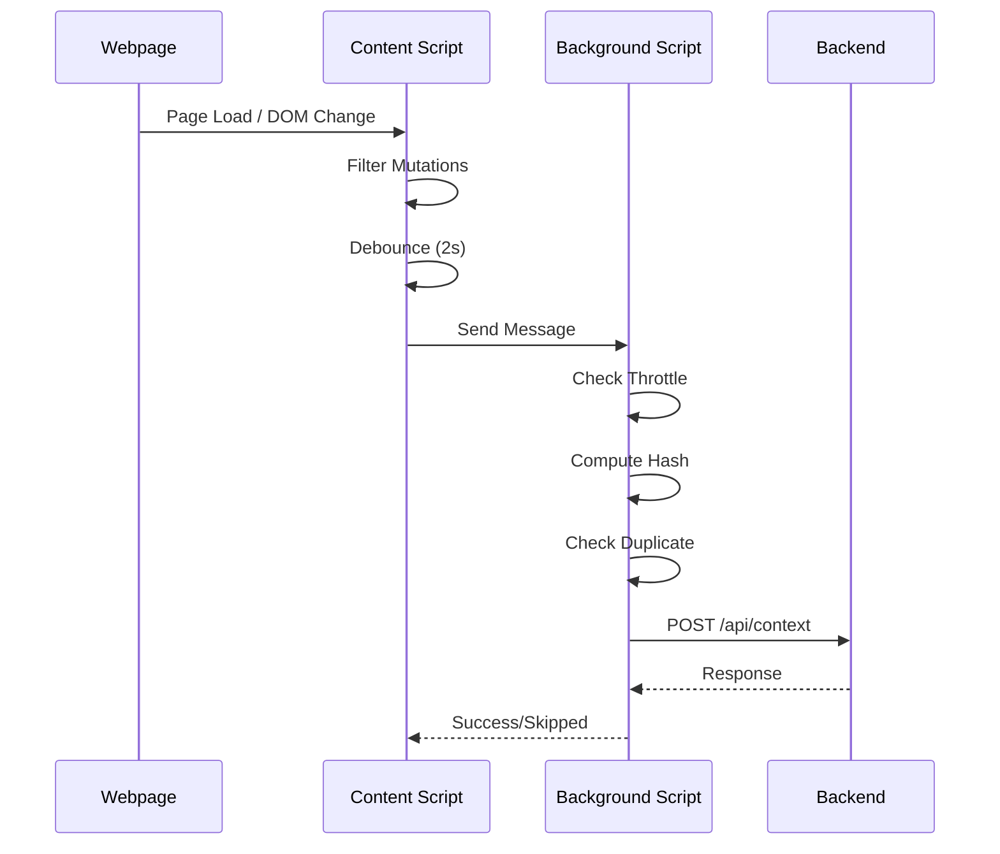
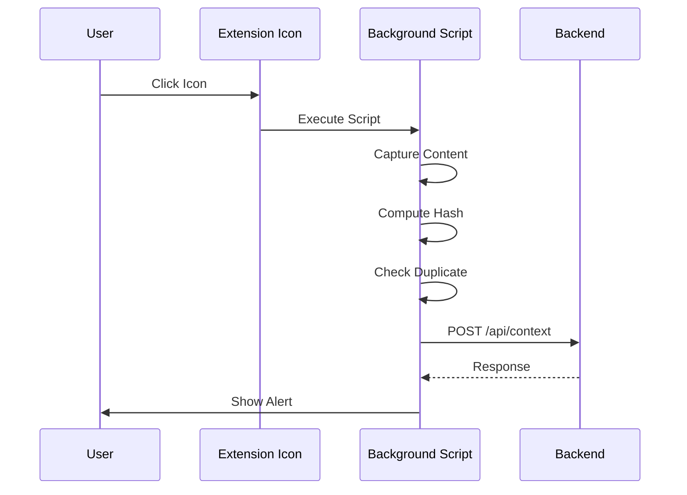

# ContextOS Chrome Extension - Auto-Capture System

## 🚀 Features Implemented

### ✅ Automatic Context Capture
- **Monitors specific websites**: WhatsApp Web, Discord, Gmail, LinkedIn, Slack
- **Triggers on**:
  - Page load
  - DOM content changes (MutationObserver)
- **Smart filtering**: Ignores trivial changes (CSS, scripts, attributes)

### ✅ Dual Deduplication System

#### 1. Hash-Based Deduplication
- Computes SHA-256 hash of captured content
- Maintains history of last 200 hashes
- Skips capture if content matches recent hash
- Prevents sending identical content multiple times

#### 2. Time-Based Throttling
- Per-site minimum intervals:
  - WhatsApp Web: 20 seconds
  - Discord: 15 seconds
  - Gmail: 30 seconds
  - LinkedIn: 25 seconds
  - Slack: 20 seconds
- Prevents excessive captures during rapid changes

### ✅ Manual Capture Still Works
- Click extension icon to capture any page immediately
- Manual captures **bypass throttling** (but still use hash dedup)
- Shows user feedback alert with capture status

---

## 📂 File Structure

```
extension/
├── manifest.json       # Extension configuration with permissions
├── background.js       # Service worker: dedup, throttle, backend API
└── content.js         # Content script: MutationObserver, auto-trigger
```

---

## 🔧 Architecture

### Content Script (content.js)
**Runs on monitored websites**

```
Page Load
    ↓
Initialize MutationObserver
    ↓
Watch for DOM Changes
    ↓
Filter Meaningful Mutations
    ↓
Debounce (2s wait after last change)
    ↓
Send Message to Background Script
```

### Background Script (background.js)
**Central coordination hub**

```
Receive Capture Request
    ↓
Check Time Throttle (for auto-capture)
    ↓
Compute SHA-256 Hash
    ↓
Check Hash Deduplication
    ↓
Send to Backend API
    ↓
Update Hash History
```

---

## 🎯 Configuration

### Auto-Capture Sites (Configurable)

```javascript
const AUTO_CAPTURE_SITES = {
  "web.whatsapp.com": 20000,  // 20 seconds
  "discord.com": 15000,        // 15 seconds
  "mail.google.com": 30000,    // 30 seconds
  "linkedin.com": 25000,       // 25 seconds
  "slack.com": 20000           // 20 seconds
};
```

**To add new sites:**
1. Add domain and interval to `AUTO_CAPTURE_SITES` in both `background.js` and `content.js`
2. Update `manifest.json` content_scripts matches array

### Deduplication Settings

```javascript
const MAX_HASH_HISTORY = 200;  // Keep last 200 hashes
```

---

## 📊 Console Logging

### Content Script Logs
```
[AutoCapture] Monitoring enabled for web.whatsapp.com (min interval: 20000ms)
[AutoCapture] MutationObserver activated
[AutoCapture] Detected 5 meaningful DOM changes
[Throttle] Too soon – skipped (wait 12s more)
[AutoCapture] Triggered on web.whatsapp.com (reason: content_change)
[Dedup] Duplicate skipped (duplicate_hash)
```

### Background Script Logs
```
=== ContextOS Reader ===
Capture type: auto
Source hostname: web.whatsapp.com
Trigger: content_change
Total characters: 4523
[Dedup] Duplicate content skipped (hash match)
========================
```

---

## 🔐 Permissions

### Added to manifest.json

```json
{
  "permissions": ["activeTab", "scripting", "storage", "tabs"],
  "host_permissions": ["<all_urls>"]
}
```

**Why each permission:**
- `activeTab`: Inject scripts on manual button click
- `scripting`: Execute content capture scripts
- `storage`: Future feature - store settings
- `tabs`: Query active tabs
- `<all_urls>`: Auto-inject content scripts on monitored sites

---

## 🧪 Testing

### 1. Install Extension
```bash
1. Open Chrome → chrome://extensions/
2. Enable "Developer mode"
3. Click "Load unpacked"
4. Select the extension/ folder
```

### 2. Test Auto-Capture
```bash
1. Open web.whatsapp.com
2. Check console (F12) - should see:
   [AutoCapture] Monitoring enabled for web.whatsapp.com
3. Send a WhatsApp message
4. Wait 2 seconds (debounce)
5. Should see capture logs
6. Backend should receive the content
```

### 3. Test Throttling
```bash
1. Send multiple WhatsApp messages quickly
2. First capture succeeds
3. Subsequent captures show:
   [Throttle] Too soon – skipped (wait Xs)
4. After 20 seconds, next capture allowed
```

### 4. Test Deduplication
```bash
1. Capture same content twice
2. First capture succeeds
3. Second capture shows:
   [Dedup] Duplicate content skipped (hash match)
```

### 5. Test Manual Capture
```bash
1. Visit any website (not monitored)
2. Click extension icon
3. Should capture immediately (no throttling)
4. Alert shows capture status
5. Backend receives content
```

---

## 🔄 How It Works

### Auto-Capture Flow



### Manual Capture Flow



---

## 📈 Performance Optimizations

### 1. Debouncing (Content Script)
- Waits 2 seconds after last DOM change
- Prevents excessive captures during typing
- Groups multiple rapid changes into one capture

### 2. Mutation Filtering
- Ignores attribute changes (CSS, classes)
- Ignores script/style tag changes
- Only captures text content changes

### 3. Hash History Limit
- Stores only last 200 hashes
- Automatically removes oldest when limit reached
- Prevents memory leaks in long sessions

### 4. Async Processing
- All operations use async/await
- Non-blocking message passing
- Service worker remains responsive

---

## 🐛 Troubleshooting

### Extension Not Auto-Capturing

**Check console logs:**
```javascript
// Should see on page load:
[AutoCapture] Content script loaded
[AutoCapture] Monitoring enabled for <hostname>
```

**If not:**
1. Reload the extension in chrome://extensions/
2. Hard refresh the webpage (Ctrl+Shift+R)
3. Check manifest.json matches array includes the domain

### Captures Being Skipped

**Throttle Message:**
```
[Throttle] Too soon – skipped (wait Xs)
```
→ Normal behavior, wait for interval to expire

**Dedup Message:**
```
[Dedup] Duplicate skipped
```
→ Content unchanged, working as designed

### Backend Not Receiving

**Check backend logs:**
```bash
cd backend
npm start
# Should show: ContextOS Backend running on http://localhost:8000
```

**Check CORS:**
- Extension background.js sends to `http://localhost:8000/api/context`
- Backend must have CORS enabled for all origins

---

## 🔮 Future Enhancements

### Planned Features
- [ ] User-configurable intervals (settings page)
- [ ] Enable/disable auto-capture per site
- [ ] Visual indicator when auto-capturing
- [ ] Capture statistics dashboard
- [ ] Export/import configuration
- [ ] Whitelist/blacklist specific URLs
- [ ] Pause/resume auto-capture globally

### Advanced Features
- [ ] Intelligent content diffing (only send changes)
- [ ] Compression before sending
- [ ] Offline queue (retry when backend down)
- [ ] Multi-backend support
- [ ] End-to-end encryption

---

## 📝 Code Quality

### Standards Used
✅ No inline scripts  
✅ No eval()  
✅ Async/await throughout  
✅ Clear console logging  
✅ Manifest V3 compliant  
✅ Service worker architecture  
✅ Message passing for communication  

### Security
✅ SHA-256 hashing (crypto.subtle API)  
✅ Content Security Policy compliant  
✅ No external dependencies  
✅ Minimal permissions requested  

---

## 🚦 Status Indicators

### Console Prefixes
- `[AutoCapture]` - Auto-capture system messages
- `[Throttle]` - Time-based throttling
- `[Dedup]` - Hash-based deduplication
- `[Hash]` - Hash computation
- `[ManualCapture]` - Manual button clicks

### Response Codes
```javascript
{ success: true }                    // Captured successfully
{ skipped: true, reason: 'throttled' }   // Too frequent
{ skipped: true, reason: 'duplicate_hash' } // Already captured
```

---

## 📄 Version History

### v2.0 - Auto-Capture Release
- ✅ Added MutationObserver for DOM watching
- ✅ Implemented SHA-256 hash deduplication
- ✅ Added per-site time throttling
- ✅ Created content script architecture
- ✅ Enhanced background script coordination
- ✅ Updated manifest to v3 with host permissions
- ✅ Preserved manual capture functionality

### v1.0 - Initial Release
- Basic manual capture on button click
- Simple text extraction
- Backend API integration

---

## 🎓 How to Customize

### Change Capture Interval for a Site

**In `background.js` and `content.js`:**
```javascript
const AUTO_CAPTURE_SITES = {
  "web.whatsapp.com": 30000, // Change from 20000 to 30000 (30 seconds)
};
```

### Add New Monitored Site

**Step 1: Edit `config.js`**
```javascript
const AUTO_CAPTURE_SITES = {
  "twitter.com": 25000, // Add new site
};
```

**Step 2: Run auto-update script**
```bash
cd extension
node update-manifest.js
# OR double-click: update-config.bat
```

**Step 3: Reload extension**
- Go to `chrome://extensions/`
- Click reload button

✅ **That's it!** The script automatically updates `manifest.json` for you.

### Change Debounce Time

**In `content.js`:**
```javascript
debounceTimer = setTimeout(() => {
  attemptCapture(trigger);
}, 3000); // Change from 2000 to 3000 (3 seconds)
```

---

**Extension Status:** ✅ FULLY FUNCTIONAL  
**Backend Required:** `http://localhost:8000/api/context`  
**Chrome Version:** Manifest V3 (Chrome 88+)
